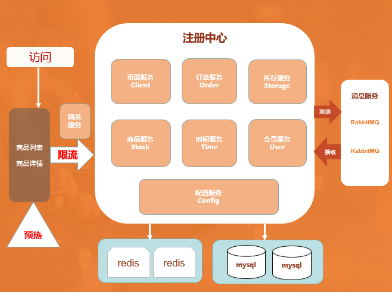
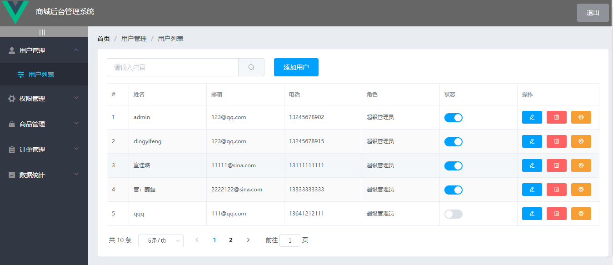

## 商品秒杀系统

## 功能介绍

### 用户端功能介绍

1. 分布式会话
2. 商品列表页
3. 商品详情页
4. 订单详情页
5. 提交订单页
6. 付款页

### 后台管理端的功能介绍

1. 用户管理
   > 用户列表
2. 权限管理
   > 角色列表
   > 权限列表
3. 商品管理
   > 商品列表
   > 分类参数
   > 商品分类
4. 订单管理
   > 订单列表
5. 数据统计
   >数据报表

## 系统功能实现

### 用户端

1. 限流：只能让秒杀成功的一小部分人进入到后台，和数据库进行交互，来减少数据库服务器的压力。   
2. 缓存：将部分业务逻辑写到缓存里，例如：商品限购数量、秒杀政策等。 
3. 异步：将业务逻辑拆分，减少服务器压力，例如：正常业务流程是下订单、付款、减库存同一时间完成，秒杀时可以将业务逻辑拆分。  
4. 预热：商家进行宣传，并提前设置好秒杀的商品、秒杀时间、限购数量，将设置的商品写入 redis 缓存。  
5. 展示：页面分为两层，第一层是商品列表页，第二层是商品详情页，通过商品列表页链接进入商品详情页，秒杀开始前，展示商品秒杀倒计时，不允许操作提交订单，只允许查看商品详情。秒杀开始时，展示商品秒杀到期时间。  
6、提交订单：秒杀提交完订单将 redis 缓存里的数量减少，并提示支付。  
7、队列操作：当支付成功之后，将秒杀成功详情写入 rabbitMQ，订单服务进行监听接收消息写入订单，库存服务进行监听接收消息减少库存。  
8、时间服务器：页面服务端通过负载进行布署，各服务器时间可能会不一致，因此增加时间服务，来提供统一的时间。 

## 性能优化策略及实现

### 页面优化

1. 页面缓存+URL缓存+对象缓存：由于并发瓶颈在数据库，想办法如何减少对数据库的访问，所以加若干缓存来提高，通过各种粒度的缓存，最大粒度页面缓存到最小粒度的对象级缓存。
2. 页面静态化，前后端分离：都是纯的html，通过js或者ajax来请求服务器，做了静态化，浏览器可以把html缓存在客户端。
3. 静态资源优化：JS/CSS压缩，减少流量；JS/CSS组合，减少连接数。
4. CDN优化：内容分发网络，就近访问。

### 高并发秒杀接口优化

1. 使用Redis预减库存减少对数据库的访问
2. 使用内存标记减少Redis的访问
3. 使用RabbitMQ队列缓冲，异步下单，增强用户体验
   
## 应用安全策略及实现 

### 双重md5密码校验

### 秒杀接口地址隐藏

>+ 每次点击秒杀按钮，才会生成秒杀地址，秒杀地址不是写死的，是从服务端获取，动态拼接而成的地址。

### 数学图形验证码

>+ 点击秒杀之前，先输入验证码，分散用户的请求。具体实现是服务端生成类似1+2-3的验证码，把结果计算出来存至服务端（缓存），把验证码图片发至客户端，此后客户端在请求秒杀地址前输入验证码值发请求验证，（去缓存里面取得值验证是否与用户输入相同），验证通过才会动态生成秒杀地址给前端。

### 接口限流防刷

>+ 利用缓存实现，用户每次点击之后访问接口的时候，在缓存中生成一个计数器，第一次将这个计数器置1后存入缓存，并给其设定有效期，比如一分钟，一分钟之内再访问，那么数值加一。一分钟之内访问次数超过限定数值，直接返回失败。下一个一分钟，数据重新从0开始计算。因为缓存具有一个有效期，一分钟之后自动失效。

## 仓库地址

### 用户端 

### 后台管理端
https://gitee.com/alphacc/vue_shop

## 开发工具 

### 用户端
IntelliJ IDEA 2020.3.1 x64

### 后台管理端
VSCode

## 开发环境				

### 用户端
| JDK |Maven | Mysql |SpringBoot | redis |RabbitMQ|
|--|--|--|--|--|--|
|1.8 | 3.2.2 | 5.5 | 1.5.9.RELEASE | 3.2 |3.7.14| 

### 后台管理端
| Vue |ElementUI | Mysql |Axios | Node |Webpack|

## 使用说明

### 用户端
1. 将项目下载到IDEA里面
2. 运行sql文件夹下的sql文件
3. 到src/main/resources下的application.properties下修改你的数据库链接用户名与密码
4. 安装redis、mysql、rabbitmq、maven等环境
5. 启动前，检查配置 application.properties 中相关redis、mysql、rabbitmq地址
6. 在数据库秒杀商品表里面设置合理的秒杀开始时间与结束时间
7. 登录地址：http://localhost:8080/login/to_login

### 后台管理端
1. 将项目下载到VSCode里面
2. 准备本地环境Node.js + MySQL + Vue
3. 启动项目

## 其它说明

1. 数据库共有一千个用户左右（手机号：18888888000~1888888888997 密码为：123456），为压测准备的。（使用 com.ljs.miaosha.util.UserUtil.java该类生成的，生成token做压测的方法也是在此类里面）

2. 邮箱只实现了前端格式验证，只需输入一个正确的邮箱格式即可（例如：ldc@qq.com）

## 图片演示

### 用户端

登录页面

商品列表页面

商品详情页面

商品秒杀倒计时

成功秒杀页面

### 后台管理端

用户列表展示

